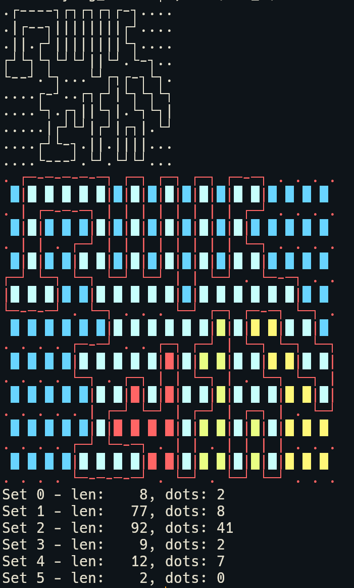
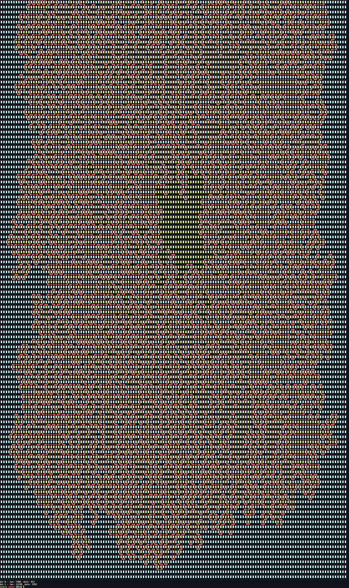

# 2023, solved 25/25

## TODO
* Understand the polynomial curve fitting from problem 9
* Understand pick's theorem and shoelace formula from 18
* Understand some of the linear algebra from 24
* Write a min cut randomizer for 25

## retrospective notes 

I wanted to go through all the problems and take any notes / look up some stuff, so I decided to put together this. I decided to rate them all on how much I enjoyed them while I was at it.

### 1
String matching

###### rating: 3/10

### 2
String manipulation and some addition

###### rating: 4/10

### 3
DFS from regex digits found, some fun set stuff to make sure no double count.

###### rating: 6/10

### 4
DP is def a weak spot for me. From looking at other solutions I don't think theres a non-n^2 solution. 

###### rating: 7/10

### 5
For part 2 this was the first problem I had fun writing a brute force to when it definitely wasn't the intended solution. `5_jit_optimized.py`. i got it to run in 42 seconds using Numba's JIT and iterating through all the maps. 

Numba seems to demand to compile ALL of the function that you decorate to native code, which makes errors much more hard to work through because typing matters a lot. There's also definitely an art to trying to intuit what the JIT will compile your code down to. Definitely a case where profiling each change is important if you care about speed.

`5_alternate_part_2.py` implements the range based splitting solution that I read about after solving with the brute force above. I actually really enjoyed this as well. Abstracting the complex range nuances into `range_difference` and `range_intersection` and then working with those concepts makes the problem very solvable even though working with ranges has tons of small off by 1 problems and complexities. 

###### rating: 9/10


### 6
I first implemented as a linear search which runs fast enough, but after I coded as a binary search for fun / practice. I read online and chatted with a friend about it and realized I didn't catch that this problem always follows a quadratic curve, which makes sense.

I just solved it mathematically by finding the critical points and subtracting for fun at the top of 6.py. I like problems with several ways to solve.

###### rating: 6/10

### 7

Implementation challenge problem for part 1. poker, but subtly different. was fun to try to make a concise function to assign the rankings of a hand, though I don't really think I succeeded in making it readable...
```python
def get_type(a, b, c, d, e):
    if a != b:
        return 1
    if a == b == c == d == e:
        return 7
    if a == b == c == d:
        return 6
    if a == b == c:
        if d == e:
            return 5
        return 4
    if c == d:
        return 3
    return 2
```

###### rating: 6.5/10

### 8

binary graph traversal problem. part 2 has multiple start and end points. we want to find the number on when all the starts are on some end. The way I solved it is by taking the LCM of the cycle length of all the starts to the ends.

I later was told by a friend that this isn't necessarily true for all inputs though, for multiple reasons. If the graph is more complex and start points can hit multiple ending points, the cycles are much much more confusing. Imagine 3 start nodes which reach an end point at the following indexes:
```
A: (2, 7, 12, 17...) AND (4, 15, 26, 37...)
B: (3, 16, 29, 42...)
```

which also can be written in a fancy math way...
```
t ≡ 2 (mod 5)   [from A]
t ≡ 4 (mod 11)  [from A]
t ≡ 3 (mod 13)  [from B]
```

I spent some time reading some math and I believe when you can solve this LCM whenever the remainders are 0, but not when they are non-zero. Then the Chinese Remainder Theorem (CRT) is used.

##### GCD tangent

CRT relies on calculating GCD's, which lead me to read about euclid's algorithm, which in itself is interesting. It's an quick iterative algorithm, and it relies on the fact that when a > b, GCD(a, b) == GCD(a % b, b). (this is basically the algorithm anyway).

And then to calculate the GCD between many integers we can just run it iteratively on pairs on numbers. But honestly even the fact that GCD(a, b, c) == GCD(GCD(a, b), c) is surprising to me, though after playing around with some numbers it does become clear you can't find an easy counterexample (I don't know the proof).

Both of the properties are interesting and I don't know if I should try to understand them more intrinsically, but I'll try to just memorize them for now.

##### Back to CRT

CRT relies on the fact that all the modulus (number after mod) is co-prime with all others. You can calculate co-primeness by taking the GCD of all numbers (using the above method). If it is anything other than 1, it is not co-prime. You can do this with arbitrary NON-co-prime inputs using prime factorization: 
```
x ≡ 1 (mod 16)
x ≡ 5 (mod 40)

After factoring above because they aren't co-prime:

x ≡ 1 (mod 2)
x ≡ 1 (mod 8)
x ≡ 5 (mod 40)

which x ≡ 1 (mod 8) is actually contained WITHIN x ≡ 5 (mod 40), so your final input is:

x ≡ 1 (mod 2)
x ≡ 5 (mod 40)
```

[Maybe there's a more straightforward way to calculate CRT without reducing the inputs to non-co-prime inputs](https://math.stackexchange.com/questions/1644677/what-to-do-if-the-modulus-is-not-coprime-in-the-chinese-remainder-theorem), but I don't have the capacity to understand that.

For non-co-prime inputs, there's actually MANY ways to find impossibilities. If you ever reduce to the same modulus, but different remainders, it is clear there is no solution. Now, for actually implementing CRT I followed [this video for the concepts](https://www.youtube.com/watch?v=ru7mWZJlRQg), which I implemented to:

```python
def crt(remainders, mods):
    total_prod = functools.reduce(lambda x, y: x * y, mods)

    products_but = [total_prod] * len(remainders)
    for index, mod in enumerate(mods):
        products_but[index] = products_but[index] // mod
    answer = 0
    for product, mod, remainder in zip(products_but, mods, remainders):
        mult = 1
        while True:
            if (mult * product) % mod == (remainder % mod):
                answer += mult * product
                break
            mult += 1
    return answer % total_prod
remainders = [2, 2, 1]
mods       = [3, 4, 5]
print(crt(remainders, mods))
```

Note, to find the modulo inverse (I hardly even know what that is). I implemented a linear search, but a faster method is using Euclid's EXTENDED algorithm.

I think for any practical usage of CRT you will need to handle the non-co-prime case since there's no real world application that would product numbers that are co-prime. So any good implementation will have to do all the prime factorization or something fancier, which really gets hairy.

Anyway, all of the above is irrelevant because the problem input has cycles that start at t=0.

###### rating: 2/10 (I don't like math)

### 9

This problem is all about fitting some curve and predicting the next value. The problem has explicit and strange instructions on what seemed to me a very roundabout way of doing exactly that, but when I read them I thought there could be a fancier way to do it in O(n) time. After struggling a bit I thought about it more and realized the instructions given might be the most efficient way to predict the curve. I'm tempted to believe the instructions given is actually close to an algorithm for polynomial fitting or something. (People were talking about the Lagrange interpolation formula online?)

I don't feel like doing the deep dive right now, but there's probably some interesting mathematical concept here. Also pascals triangle is probably related here.

I'm also happy I found the input reversal trick for part 2.

###### rating: 5.5/10

### 10

A bit mind bending to think about. I realized pretty quickly after part 1 that I needed to write a "0.5 index" DFS. This felt familiar to me because I realized this problem is actually just a maze creation algorithm I wrote long ago. It was my first ever personal project I had ever written. (I didn't make the algorithm). You first act as a point following the lines of the maze throughout a 2D grid, then you use the space in-between the lines as your playing space (the solving), and the lines are your walls.

The only hiccup at the end was determining which space was "inside" and which was "outside", which normally isn't a problem in mazes because they are fully connected. I ended up just printing all spaces and guessing based off this visualization I made during debugging




There's also another solution method that involved tracking parity of if we're inside or not on every row. Don't worry, we'll cover that in a later problem.

###### rating: 9.5/10 (nostalgia)

### 11

Big galaxies. Part 1 I wrote some fun array in-place substitution code. Part 2 I realized that the optimal path never changes based on how large an empty space is. If you have to traverse through an empty space, its the fastest path so you can just define a cost for each space and write a greedy search to go galaxy to galaxy resulting in N^2 * M^2 solution. 

Adding walls may have been fun for part 2 just so you would have to write a BFS that would have to generate nodes cleverly whenever you hit an empty row or column.

###### rating: 7/10

### 12

This was the second problem I spent a long time brute forcing, but this time with C++ instead of aggressive JIT (`12_c++.cpp`). I spent a long time optimizing the code WITHOUT memoizing anything. The most interesting speedup was precomputing useful info at every spring index. I got to learn a new feature of `perf`, which is tabbing through annotated code with its associated assembly.

###### rating: 8/10

### 13

Ah reflection. A problem featuring variable names such as `GOD_NO`. Straight forward with some tricky edge cases for part 2 smudging.

###### rating: 5/10

### 14

I wrote the initial solution as a slow simulation of the problem, then I found the cycle length and extrapolated it to `1000000000`. I then went back and wrote the brute force for fun with no cycle detection because I was having fun writing performant c++ code. I got it down to ~7 hours completion time. This problem was also my top rank at `229`. I think this was my best chance to score top 100, but maybe next year :)

###### rating: 7/10 (simulators are fun)

### 15

Good practice implementing some parts of a hash table. I've been meaning to go back and implementing a full one in C or C++. Hard to read problem description :(

###### rating: 6/10

### 16

More DFS with some complications, my specialty. Second highest rank at `237`.

###### rating: 6/10

### 17

BFS again.

###### rating: 5/10

From this point on, the difficulty really was turned up for me. 18 on all took a somewhere between 1 hours - 30 hours.

### 18

Part 1 I implemented flood-fill. For part 2, the most "generic" way other people online did this with Pick's theorem and the shoelace formula, which involved calculating polygon areas from arbitrary points. 

I had not idea what these were, so I ended up trying something different. For part 2 I realized one dimension was traversable. ~100s of millions vs. two dimensions: 1e+16. I remembered problem 10, which I solved with flood-fill. I had first failed with that problem to implement some idea involving going left to right to calculate areas. I decided to give that another go for this. The intuition being that at any point, I could "look" up and determine if the area above me was "inside" the pipe, or outside based on if there are an even or odd number of walls above me.

Looking back I think I should have written a better visualizer to try to understand this, but I plugged away at trying to picture it in my head. What ended up working is exactly the parity checking, but how you count corners and walls of the opposite direction matters, and that ended up being a lot of the issues. Turns out this process is close to a (maybe old?) GPU shader trick on how to determine what pixels to paint.

Total runtime with this in python ended up being ~10ish minutes.

There's more to learn here about polygons, and I may end up with a higher opinion of this problem once I understand them.

###### rating: 5/10

### 19

An very similar problem to the range based solution for 5. I actually appreciated reimplementing the range concepts from 5 again to reinforce those concepts from earlier in the month.

###### rating: 8/10

### 20

More cycles you say?

Was tricky understanding what how they wanted this to execute, but it was very reminiscent of Minecraft redstone programming which I appreciated. I had fun implementing an optimized C++ solution again, but it ended up not being fast enough. Upon knowing how large the answer is, I think the c++ would have taken ~1 month to complete.

I really appreciate just how much faster mapping strings to integers is after this problem. Vector/array based lookups is so much faster than the stdlib's unordered_map.

I then took a look at the input and found the 4 different cycles I needed for the final answer to solve it and hardcoded that in python.

###### rating: 8/10

### 21

This and problem 25 were the problems I was worried I may be unable to solve while I was thinking about them. Once I had the realization there must be some sort of cycle, I gained confidence again.

I spent a long time trying to use math + DFS knowledge to calculate the area of one complete square up and to the right, then summing the number of complete squares and DFS the extremities. But there are a LOT of edge cases, and questions given an arbitrary input. I still think it would work, but it was very hard to reason about.

I enjoyed having the realization of cycles. When I realized, I ran it to the test input and saw that as the number of steps increased, the squares reached always oscillated between 40-41% of the number of steps. Then it was just a matter of looking at the data dumps for a few hours and I had it.

After solving and taking a closer look at the real input it is very funny that with the real input you can make two large assumptions that the test case does not. 

1. Reaching the outer extreme of every square is equal to the manhattan distance. This is because there's a "highway" between the middle and the outside in every direction. 
2. There's a very large rhombus in the middle ring of the map. 

Both of these facts can combine to produce a VERY easy area solution which I appreciated, but probably would not have seen.

###### rating: 7.5/10

### 22

I tried to be clever solving this a few times, then I realized I just needed to simulate it. I think maybe writing a DFS graph searcher for dependencies would be the only faster way.

All in all not a crazy complicated problem, just some difficulties with implementation.

###### rating: 8/10

### 23

Another brute forcing problem. Turns out I think you have to brute force it since people online say that finding the LONGEST path in a graph is NP-hard. There's a ton of speedups I think you could add though based on constraints of the problem, whereas my search is super dumb.

I think the most basic graph condensing here is just nodes with 1 input -> output can be removed and added to the previous distance.

###### rating: 6/10

### 24

Well, that took awhile. By far the longest problem. I think I spent probably 30 hours thinking + coding this one. I started over with new approaches maybe 6 times. I ended up solving part 1 mathematically, and part 2 very UN-mathematically.

For part 2 I solved it with a visualizer, a custom binary search brute force, and hours of guess and check.

###### rating: 1/10 (I really don't like linear algebra)

### 25

I ended up just writing the brute force in c++ that took like 16 hours to run. Mincut is the graph algorithm that everyone used to find the minimum number of cuts needed (edges) to separate two groups.

I tried implementing `25_mincut.py` after the fact with Kruskal's algorithm, but tracking the edges cut seems to be difficult.

###### rating: 5/10